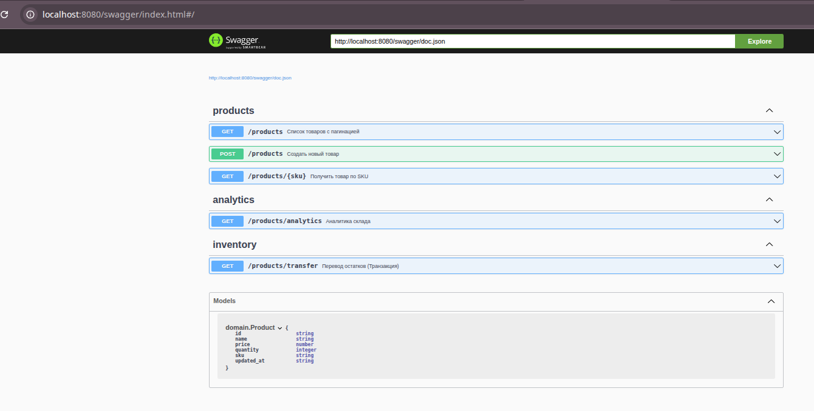

# Inventory Service (Go + MongoDB)

Промышленный микросервис для управления складским инвентарём. Реализован с использованием **Clean Architecture**, поддерживает транзакции в MongoDB и автоматическую генерацию документации через Swagger.

## 🚀 Стек технологий

* **Language:** Go 1.22+
* **Database:** MongoDB 6.0 (Replica Set)
* **Framework:** chi (HTTP Router)
* **API Documentation:** Swagger (swag)
* **DevOps:** Docker, Docker Compose, Air (Live Reload)

---

## 📄 API документация (Swagger)

После запуска проекта документация доступна по адресу:
[http://localhost:8080/swagger/index.html](http://localhost:8080/swagger/index.html)



---

## ⚡ Быстрый запуск

### 1. Запуск всей инфраструктуры

```bash
docker-compose up --build
```

---

## 📦 Работа с API

### ➕ Создание товара

```bash
curl -X POST http://localhost:8080/products \
     -H "Content-Type: application/json" \
     -d '{"name": "iPhone 15", "sku": "apple-15", "price": 999.99, "quantity": 10}'
```

Пример ответа:

```json
{
  "id": "69c39d5e7d29a894c5559204",
  "name": "iPhone 15",
  "sku": "apple-15",
  "price": 999.99,
  "quantity": 10,
  "updated_at": "2026-03-25T08:31:26.9049421Z"
}
```

---

### 📥 Получение товара по SKU

```bash
curl http://localhost:8080/products/apple-15
```

---

### ➕ Создание нескольких товаров

```bash
curl -X POST http://localhost:8080/products \
     -H "Content-Type: application/json" \
     -d '{"name": "iPhone 15", "sku": "iphone", "price": 1000, "quantity": 10}'

curl -X POST http://localhost:8080/products \
     -H "Content-Type: application/json" \
     -d '{"name": "Samsung S24", "sku": "samsung", "price": 900, "quantity": 10}'
```

---

### 📋 Получение списка товаров

```bash
curl "http://localhost:8080/products?limit=1&offset=1"
```

---

### 📊 Получение аналитики

```bash
curl -i "http://localhost:8080/products/analytics"
```

---

## 🗄️ Работа с MongoDB

### Подключение к контейнеру

```bash
docker exec -it mongodb_inventory mongosh
```

---

### Использование базы данных

```bash
use inventory_db

db.products.find({ sku: "iphone" })
db.products.find({ sku: "samsung" })
```

---

### Получение всех товаров

```bash
docker exec -it mongodb_inventory mongosh inventory_db --eval "db.products.find()"
```

---

### Просмотр индексов

```bash
docker exec -it mongodb_inventory mongosh inventory_db
```

```bash
db.products.getIndexes()
```

---

## 📜 Логи приложения

```bash
docker compose logs -f app
```

---

## 🛠 Генерация Swagger-документации

```bash
swag init -g cmd/server/main.go
```

---

## 🧹 Что было исправлено

* Исправлены опечатки: *Получнеие → Получение*, *инвентарем → инвентарём*
* Закрыты все Markdown-блоки
* Убраны "сломанные" секции
* Логически разделены блоки (API / Mongo / Logs)
* Добавлены заголовки и эмодзи для читаемости
* Приведён единый стиль команд

